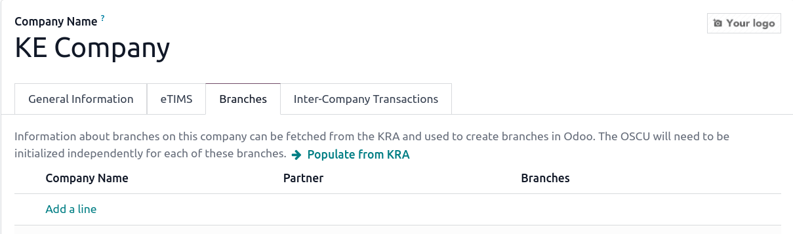
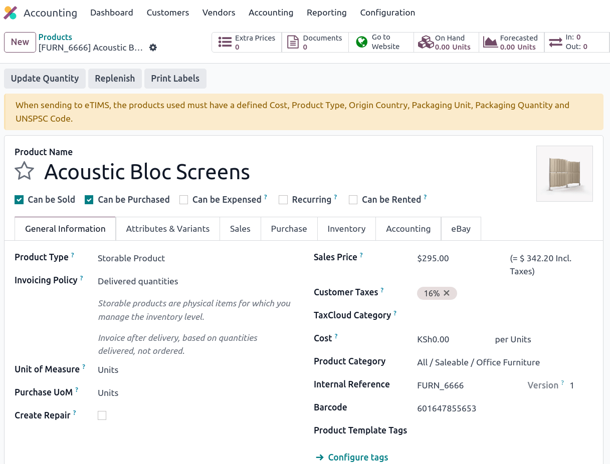
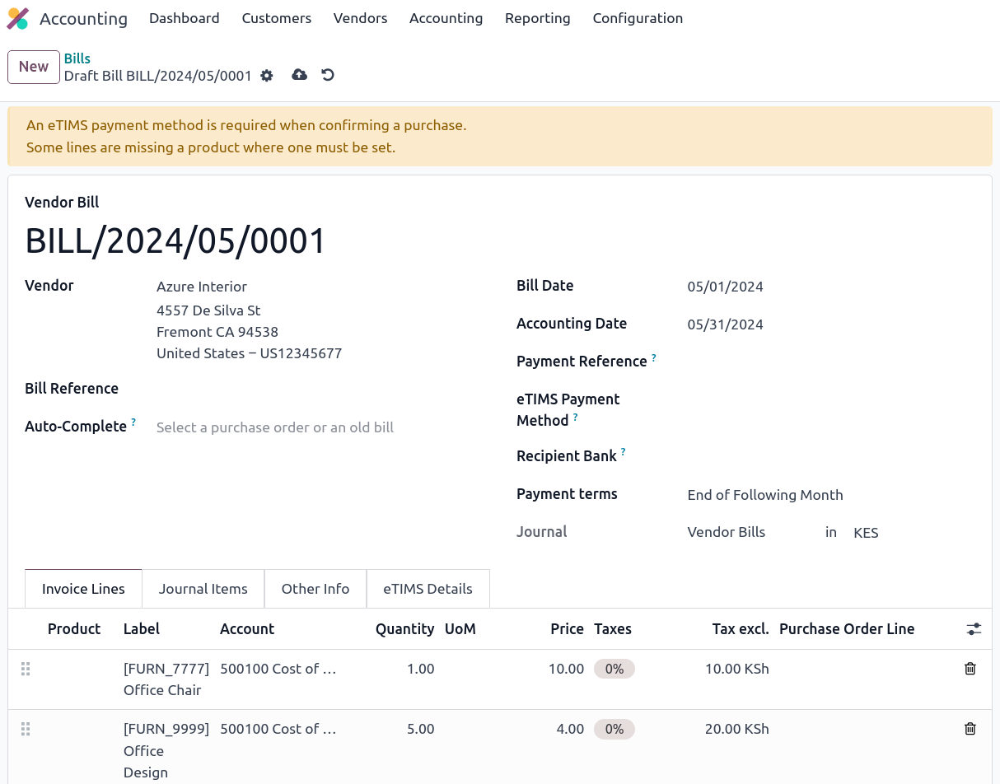

=====
Kenya
=====

.. _localization/kenya/configuration:

Configuration
=============

Install the 🇰🇪 **Kenyan** :ref:`fiscal localization package <fiscal_localizations/packages>` to get
all the features of the Kenyan localization.

eTIMS
=====

The `Kenya Revenue Authority (KRA) <https://www.kra.go.ke/>`_ has implemented the
`electronic Tax Invoice Management System (eTIMS) <https://www.kra.go.ke/online-services/etims>`_
for tax collection.

To submit documents through eTIMS, you must use an :abbr:`OSCU (Online Sales Control Unit)` that
integrates with the existing **Trader Invoicing System (TIS)**, such as the one provided by Odoo.
The OSCU is used to validate, encrypt, sign, transmit, and store tax invoices.

.. note::
   Make sure to :ref:`install <general/install>` the **Kenya eTIMS EDI** modules to fully use the
   OSCU device.

.. _kenya/initialization:

OSCU device initialization
--------------------------

The OSCU must be initialized before use. Before initialization, navigate to :menuselection:`Settings
--> General Settings`, click :guilabel:`Update Info` in the :guilabel:`Companies` section, and enter
your :guilabel:`Tax ID`.

To initialize the OSCU, go to the :guilabel:`eTIMS` tab. Fill in the :guilabel:`eTIMS Branch Code`
and :guilabel:`Serial Number` of the device. Make sure to set :guilabel:`eTIMS Server Mode` to
:guilabel:`Test` for the initialization. When done, tick the **user agreement** and click
:guilabel:`Initialize OSCU`. Your device is now authenticated.

.. note::
   Three server modes are available:

   - :guilabel:`Demo`: Designed for demo purposes; it uses mock data and does not require an
     initialized OSCU;
   - :guilabel:`Test`: Used to test the connection to eTIMS;
   - :guilabel:`Production`: Used for live databases ready to send data.

.. Important::
   If your device has **already been authenticated** (through another ERP, for example), enable
   :doc:`../../general/developer_mode`. Then, go to the :guilabel:`eTIMS` tab and, in the
   :guilabel:`Device Communication Key` field, enter the key obtained through a previous
   authentication. Click :guilabel:`Save manually`, then :guilabel:`Initialize OSCU` (which It may
   take a moment to become available).

eTIMS codes
-----------

Common standard codes are **automatically** fetched from the KRA eTIMS API servers every **two
days**. These can be fetched **manually** by:

#. Enabling the :doc:`../../general/developer_mode`;
#. Going to :menuselection:`Settings --> Technical --> Automation: Scheduled Actions` and searching
   for :guilabel:`KE eTIMS: Fetch KRA standard codes`;
#. Clicking the action in the list, and clicking :guilabel:`Run Manually` to fetch the codes.

The complete list of fetched OSCU codes can be found under :menuselection:`Accounting -->
Configuration --> KE OSCU Codes`.

.. image:: kenya/oscu-codes.png
   :alt: List of fetched OSCU codes.

.. _etims/unspsc:

UNSPSC codes
------------

The KRA needs UNSPSC codes for a product to be **registered**. UNSPSC codes are **automatically**
fetched from the KRA eTIMS API servers **every day**. To fetch them manually, proceed as follows:

#. Enabling the :doc:`../../general/developer_mode`;
#. Going to :menuselection:`Settings --> Technical --> Automation: Scheduled Actions` and searching
   for :guilabel:`KE eTIMS: Fetch UNSPSC codes from eTIMS`;
#. Clicking the action in the list, and then clicking :guilabel:`Run Manually` to fetch the codes.

The complete list of fetched UNSPSC codes can be found under :menuselection:`Accounting -->
Configuration --> KE OSCU Codes`.

Notices
-------

Notices are **automatically** fetched from the KRA eTIMS API servers **every day**. These notices
can be fetched **manually** by:

#. Enabling the :doc:`../../general/developer_mode`;
#. Going to :menuselection:`Settings --> Technical --> Automation: Scheduled Actions` and searching
   for :guilabel:`KE eTIMS: Fetch KRA notices from eTIMS`;
#. Clicking the action in the list, and then clicking :guilabel:`Run Manually` to fetch the codes.

The complete list of fetched notices can be found under :menuselection:`Accounting --> Configuration
--> KE OSCU Notices`.

Multi-company
-------------

.. _kenya/branch:

.. seealso::
   :doc:`../../general/companies`

If you have :ref:`multiple companies <accounting/multi-company>`, you can centralize and manage them
all on a single Odoo database. The **KRA** identifies and differentiates the **main** company from
**subsidiaries** by using **IDs**. Furthermore, **subsidiaries** are classified as **branches** of
the **main company**.

To configure the company ID, open the **Settings** app, click :guilabel:`Update Info` in the
**Companies** section, then click the :guilabel:`eTIMS` tab. In a multi-company environment, the
**main company** has a branch ID equal to `00` . Companies that are *not* the main company have a
branch ID other than `00` and are assigned an ID **by the KRA**.

To add a **branch**, open the **Settings** app, click :guilabel:`Update Info` in the **Companies**
section, and in the :guilabel:`Branches` tab, click :guilabel:`Add a line`.

.. note::
   The KRA considers that each **place of supply** corresponds to a branch (ID).

To fetch the **branch ID** rom the KRA for your non-main companies, make sure the main company has a
Kenyan :guilabel:`Tax ID` and the OSCU device has been :ref:`initialized <kenya/initialization>`.
Then, go to the :guilabel:`Branches` tab and click :guilabel:`Populate from KRA`.

.. note::
   The **OSCU** device must be :ref:`initialized independently <kenya/initialization>` for each
   branch.

Contact branch ID
-----------------

To attribute a branch code to a contact, access the contact form, go to the :guilabel:`Accounting`
tab, and enter the branch code in the :guilabel:`eTIMS Branch Code` field.

.. note::
   By default, contacts' branch codes are set to `OO`.

KRA sequences
-------------

.. important:
   Odoo invoice sequences and KRA sequences are **different**.

In Odoo, invoice sequences depend on the **main company**. Main companies can see the invoices of
branches, but branches **cannot** see the main company's invoices or those of other branches.

.. example::
   If you have a **main** company with **two branches**, the invoice sequence would be the
   following:

   - Creating an invoice on **branch 1**: INV/2024/00001;
   - Creating an invoice on **branch 2**: INV/2024/00002;
   - Creating on invoice on the **main company**: INV/2024/00003.

The KRA, however, needs **independent** sequences per branch. Odoo, therefore, manages sequences
**individually** per branch.

.. example::
   This is how Odoo manages sequences to be compliant with the KRA regulations:

   - Creating an invoice on **branch 1**: INV/2024/00001;
   - Creating an invoice on **branch 2**: INV/2024/00001;
   - Creating an invoice on the **main company**: INV/2024/00001.

Insurance
=========

For **health service providers**, you can send **insurance information** about the main and branch
offices and update it in eTIMS. To do so, open the **Settings** app, click :guilabel:`Update Info`
in the **Companies** section, and in the :guilabel:`eTIMS` tab, fill in the fields related to your
company: :guilabel:`Insurance Code`, :guilabel:`Insurance Name`, and :guilabel:`Insurance Rate`.

.. _kenya/product-registration:

Product registration
====================

The KRA requires **products to be registered** first before business operations (such as stock
movements, :abbr:`BOM (Bill of Materials)`, customer invoices, etc.). For a product to be
registered, the following fields must be defined in the product form:

- Under the :guilabel:`General information` tab: :guilabel:`Cost`.
- Under the :guilabel:`Accounting` tab:

- :guilabel:`Packaging Unit`;
- :guilabel:`Packaging Quantity`;
- :guilabel:`Origin Country`;
- :guilabel:`eTIMS Product Type`;
- :guilabel:`Insurance Applicable`;
- :ref:`UNSPSC Category <etims/unspsc>`.

Odoo checks to see if the elements above are defined when conducting business operations. If yes,
the product is automatically registered while sending the operation to the KRA. If not, you are
alerted by a yellow banner at the top of the screen, inviting you to check the missing elements by
clicking :guilabel:`View Product(s)`.

Stock movements
===============

All **stock movements** must be sent to the KRA. They do not require an invoice if they are
**internal operations** or **stock adjustments**. Therefore, Odoo automatically sends them if at
least one of the following conditions are met:

#. No contact is set for the move;
#. The contact is your main company or a branch of the main company.

If the stock moves are **external operations** (e.g., to partners that are not part of the main
company or its branches), the stock moves are automatically sent *after* the invoice is sent to
eTIMS.

.. note::
   - The stock move must be confirmed before sending the invoice to eTIMS;
   - The product(s) must be registered for the stock move to be sent to eTIMS. If not, a yellow
     banner appears to prompt registration.

Purchases
=========

Odoo automatically fetches new vendor bills from eTIMS every day. You need to confirm the fetched
vendor bills and send the confirmation to the KRA. Every bill confirmation must be associated with a
validated receipt. To do so, each bill must be linked to purchase order lines.

.. _kenya/purchases:

In the case of purchases **(not customs imports)**, the steps to link purchase order lines with
bills are the following:

#. The vendor bill is fetched from the KRA servers. The JSON file is available in the chatter of the
   vendor bill if needed;
#. Odoo looks at the :guilabel:`Tax ID` (PIN) of the partner;

   - If it is unknown, a new partner is created;
   - If it is known and the branch ID is the same, Odoo uses the known partner.

#. You must match the fetched vendor bill with an existing product. Each vendor bill must contain a
   product to be confirmed and sent to eTIMS later on;
#. Odoo looks at the existing purchase order lines matching the product and partner (if any). You
   must select the correct related purchase order line from the :guilabel:`Purchase Order Line`
   dropdown list. The received quantities on the purchase order must be the same as those indicated
   on the vendor bill. If not, the vendor bill cannot be sent to eTIMS (indicated by a yellow
   banner).

   - If no existing purchase order lines match the fetched invoice lines, you can create a purchase
     order based on the unmatched lines and validate the resulting stock move. Then, confirm and
     send the bill to eTIMS.

#. Make sure to set a method in the :guilabel:`eTIMS Payment Method` field of the bill to send the
   vendor bill to the KRA;
#. Once all steps are completed, the vendor bill can be sent by clicking :guilabel:`Send to eTIMS`.
   When the vendor bill has been confirmed on eTIMS, the **KRA invoice number** can be found under
   the :guilabel:`eTIMS Details`.

Invoicing
=========

.. note::
   The KRA does *not* accept sales if the product is not in stock.

This is the **advised sales flow** in Odoo when selling:

#. Create a **sales order**;
#. :guilabel:`Validate` the invoice;
#. :guilabel:`Confirm` the invoice;
#. Click :guilabel:`Send and print`, and then tick the :guilabel:`Send to eTIMS` box;
#. Finally, click :guilabel:`Send & print` to send the invoice.

Once the invoice has been sent and signed by the KRA, the following information can be found on
it:

- **KRA invoice number**;
- Mandatory KRA invoice fields, such as **SCU information**, **date**, **SCU ID**, **receipt
  number**, **item count**, **internal date**, and **receipt signature**;
- The **KRA tax table**;
- A unique **KRA QR code** for the signed invoice.

Imports
=======

Customs imports codes are **automatically** fetched from the KRA eTIMS API servers **every day**.
To fetch them manually, proceed as follows:

#. Enabling the :doc:`../../general/developer_mode`;
#. Going to :menuselection:`Settings --> Technical --> Automation: Scheduled Actions` and search
   for :guilabel:`KE eTIMS: Receive Customs Imports from the OSCU`;
#. Clicking the action in the list, and then clicking :guilabel:`Run Manually` to fetch the codes.

Go to :menuselection:`Accounting --> Vendors --> Customs Imports` to view the imported codes.

The following steps are required to send and have **customs imports** signed by the KRA:

#. Go to :menuselection:`Accounting --> Vendors --> Customs Imports`;
#. The customs import is fetched automatically from the KRA;
#. You *must* match the imported item with an existing registered product (or create a product if no
   related product exists) in the :guilabel:`Product` field;
#. Set a vendor in the :guilabel:`Partner` field;
#. Based on the partner, you must match the imported item with its related purchase order (see
   :ref:`purchase steps <kenya/purchases>`). The stock must be correctly adjusted when the customs
   import is approved;
#. If no related purchase order exists, you must create one and :guilabel:`Confirm Order`. The
   :guilabel:`Product` and :guilabel:`Partner` must have been set before. If a purchase order
   already exists, :guilabel:`Confirm Order`;
#. Confirm the delivery by clicking :guilabel:`Receive Products` on the purchase order, and then
   :guilabel:`Validate`;
#. Finally, click :guilabel:`Match and Approve` or :guilabel:`Match and Reject`, depending on the
   situation of the goods.

.. note::
   The JSON file received from the KRA is attached to the chatter of the customs import.

BOM
===

The KRA requires all BOMs to be sent to them. To send BOMs to eTIMS, the product and its components
*must* be :ref:`registered <kenya/product-registration>`. To access a product's BOM, click on the
product, and then click the :guilabel:`Bill of Materials` smart button.

Fill in the KRA's required fields in the guilabel:`KRA eTIMS details` section of the
:guilabel:`Accounting` tab, and then click :guilabel:`Send to eTIMS`. The successful sending of the
BOM is confirmed in the chatter, where you can also find the sent information in an attached JSON
file.

Credit notes
============

The KRA does not accept credit notes with quantities or prices higher than the initial invoice. A
KRA reason must be indicated when reversing the invoice: in the customer credit note form, go to the
:guilabel:`eTIMS Details` tab and select the :guilabel:`eTIMS Credit Note Reason`, then select the
invoice number in the :guilabel:`Reversal of` field.
