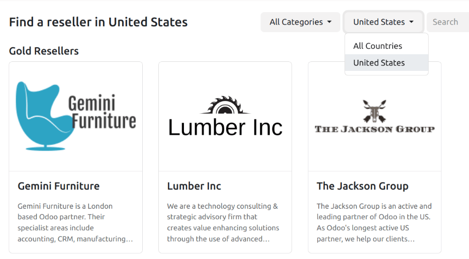
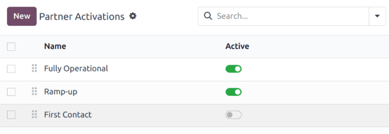

=========
Resellers
=========

Within Odoo's *CRM* app, leads can be forwarded to resellers (or partners). Leads can be manually
assigned, or can be automatically assigned based on the resellers designated *level*, and location.

Configuration
=============

To utilize the reseller features, the *Resellers* module first needs to be installed. Navigate to
the :menuselection:`Apps` application, and remove the :guilabel:`Apps` filter from the
:guilabel:`Search...` bar. Then search for `Resellers`.

.. image:: resellers/resellers-module.png
   :align: center
   :alt: The resellers module in Odoo.

After the module is installed, navigate to the :menuselection:`CRM app`. Under the
:menuselection:`Configuration` menu is a new section, titled *Resellers*.

Partner levels
==============

Partner *levels* are used to differentiate between various resellers. To view the partner levels,
navigate to :menuselection:`CRM app --> Configuration --> Partner Levels`.

Three levels are created by default in the *CRM* app:

- :guilabel:`Gold`
- :guilabel:`Silver`
- :guilabel:`Bronze`

New levels can be added, as needed, and the existing levels can be edited and renamed, if desired.

Level weight
------------

Level weight is used to decide the probability a partner to be assigned a lead or opportunity. The
level weight should be a numerical value, greater than zero. If the weight is zero, no leads are
assigned.

.. tip::
   Level weight can be assigned on an individual contact record. The weight assigned on the
   individual record overwrites the default weight assigned on the level configuration form.

.. _crm/partner-activations:

Partner activations
===================

Partner *activations* are used to identify the status of a partner. Activations are assigned on an
individual contact record, and can be used to group or filter the :guilabel:`Partnership Analysis`
report. To view the partner levels, navigate to :menuselection:`CRM app --> Configuration -->
Partner Activations`.

Three activation types are created by default in the *CRM* app:

- :guilabel:`Fully Operational`
- :guilabel:`Ramp-up`
- :guilabel:`First Contact`

New levels can be added, as needed, and the existing levels can be edited and renamed, if desired.
To change the active status of an activation, slide the toggle of the desired activation to the
*inactive* position.

   The list of default Partner Activations in the CRM app. The toggle for First Contact is in the
   inactive position, while the rest are active.

Partner assignments
===================

After partner levels and partner activations have been configured, individual partner records can be
configured.

To update an individual partner record, navigate to :menuselection:`CRM app --> Sales -->
Customers`, and click the Kanban card for the desired partner to open the customer record.

On the customer record, click the :guilabel:`Partner Assignment` tab.

Click in the :guilabel:`Partner Level` field, and select an option from the drop-down menu to assign
a level. Then, click the :guilabel:`Level Weight` field to assign a different level weight, if
necessary.

Publish partners
================

To publish a list of all active partners on the website, a new webpage needs to first be created.
Navigate to :menuselection:`Website app --> Site --> Pages` and click :guilabel:`New`. Hover over
the :guilabel:`Blank Page` template, and click the :guilabel:`Use this template` button to create a
new page.

In the :guilabel:`New Page` pop-up window, enter `Partners` in the :guilabel:`Page Title` field.
Then click :guilabel:`Create`.

