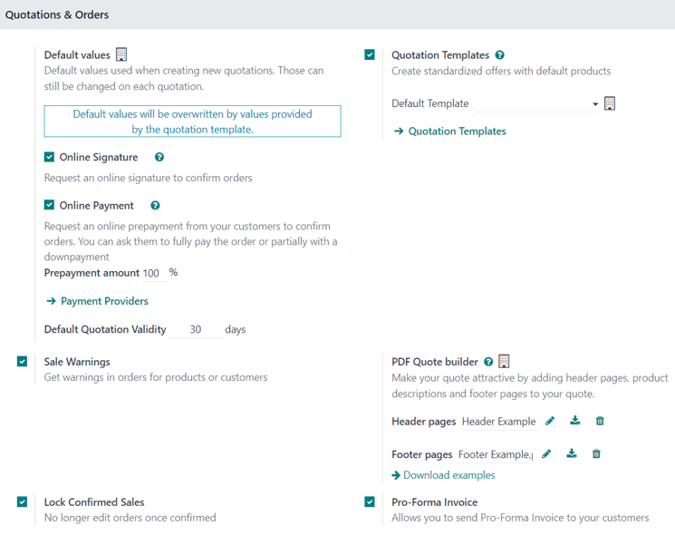
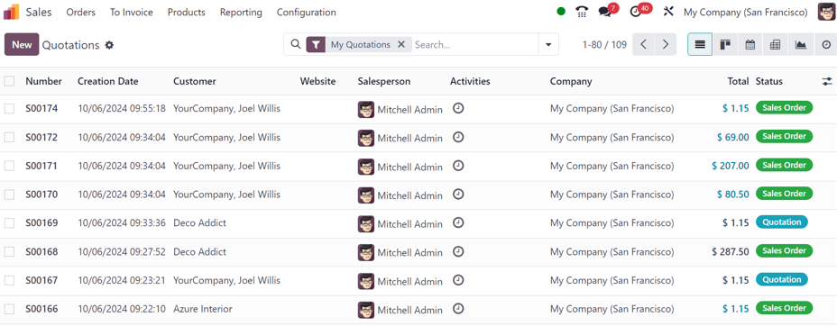
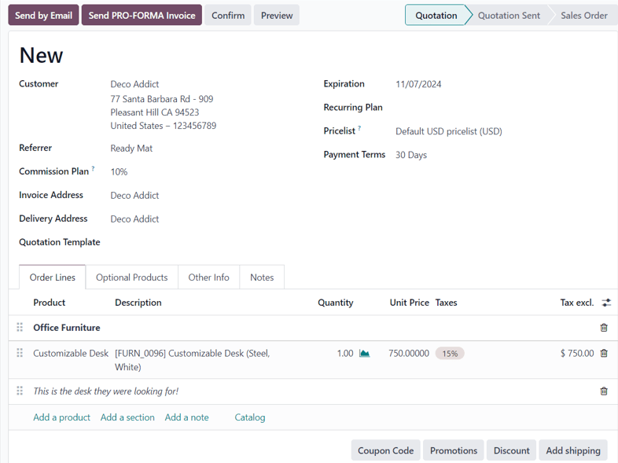

=================
Create quotations
=================

In Odoo *Sales* quotations can be quickly created and sent to customers. Once a quotation has been
confirmed, it officially turns into a *sales order*, which can then be invoiced and paid for.

Quotation settings
==================

While the ability to create and send quotations in the Odoo *Sales* application is avaialble, by
default, there are a collection of quotation and order settings that can be customized and
configured, if needed.

To access these setting options, navigate to :menuselection:`Sales app --> Configuration -->
Settings`, and scroll to the :guilabel:`Quotations & Orders` section.

- :guilabel:`Quotation Templates`: create unique quotation templates featuring standardized offers
  with default products, which can be easily accessed from a quotation form. When this checkbox is
  ticked, an additional field, :guilabel:`Default Template` appears, along with a link to the
  :guilabel:`Quotation Templates` page. To learn more, refer to the :doc:`Quotation templates
  <quote_template>` documentation.
- :guilabel:`Online Signature`: request an online signature to confirm orders. To learn more, refer
  to the :doc:`Online payment order confirmation <get_signature_to_validate>` documentation. 
- :guilabel:`Online Payment`: request an online prepayment from customers to confirm orders. Request
  a full payment or paritial payment (via down payment). When this checkbox is ticked, an additional
  field, :guilabel:`Prepayment amount (%)`, appears. There is also a link to the :guilabel:`Payment
  Providers` page, as well. To learn more, refer to the :doc:`Online payment order confirmation
  <get_paid_to_validate>` documentation.
- :guilabel:`Default Quotation Validity`: determine an amount (in :guilabel:`days`) that quotations
  can remain valid for, by default.
- :guilabel:`Default Recurrence`: determine a default period from the drop-down menu to use as a
  recurrence for a new quotation.
- :guilabel:`Sale Warnings`: get warnings in orders for specific products or customers.
- :guilabel:`PDF Quote builder`: customize the look of quotations with unique header pages, product
  descriptions, footer pages, and more. To learn more, refer to the :doc:`PDF quote builder
  <pdf_quote_builder>` documentation.
- :guilabel:`Lock Confirmed Sales`: ensure that no further edits can be made to confirmed orders.
- :guilabel:`Pro-Forma Invoice`: send pro-forma invoices to customers. To learn more, refer to the
  :doc:`Pro-forma invoices <../invoicing/proforma>` documentation.

To activate any of these settings, tick the checkbox beside the desired option(s). Then, click
:guilabel:`Save`.

Quotations dashboard
====================

To access the *Quotations* dashboard, which is the default dashboard of the *Sales* app, simply
click the :menuselection:`Sales app` from the main Odoo dashbord.

.. tip::
   If already in the *Sales* application, the :guilabel:`Quotations` dashboard can be accessed by
   navigating to :menuselection:`Orders --> Quotations` from the header menu in the *Sales*
   application.

By default, the :guilabel:`Quotations` dashboard displays all the quotations in the database that
are related to the current user, as indicated by the default :guilabel:`My Quotations` filter
present in the :guilabel:`Search...` bar.

.. note::
   To view *all* quotations in the database, remove the :guilabel:`My Quotations` filter from the
   :guilabel:`Search...` bar.

Quotations on this page appear in a default list view, but can also be viewed in a
:icon:`oi-view-kanban` :guilabel:`Kanban` view, :icon:`fa-calendar` :guilabel:`Calendar`,
:icon:`oi-view-pivot` :guilabel:`Pivot` table, :icon:`fa-area-chart` :guilabel:`Graph`, or
:icon:`fa-clock-o` :guilabel:`Activity` view.

To view and/or modify any listed quotation from the :guilabel:`Quotations` dashboard, simply click
on the desired quotation line from the list, and Odoo reveals the specific form for that selected
quotation.

Create quotation
================

To create a quotation in the Odoo *Sales* application, open the :menuselection:`Sales app`, and
click the :guilabel:`New` button, located in the upper-left corner of the main
:guilabel:`Quotations` dashboard.

.. important::
   The :guilabel:`New` button is **only** present if the :guilabel:`Quotations` dashboard is in list
   or Kanban view.

Clicking the :guilabel:`New` button reveals a blank quotation form, with various fields and tabs to
configure.

Begin by entering the customer's name in the :guilabel:`Customer` field at the top of the form. This
is a **required** field.

If the customer's information is already in the database, the :guilabel:`Invoice Address` and
:guilabel:`Delivery Address` fields auto-populate with the saved information for those respective
fields, based on the data from that customer's contact record (found in the *Contacts* application).

If the customer was referred by another customer or contact, enter their name in the
:guilabel:`Referrer` field.

If a :guilabel:`Referrer` is selected, a new field, :guilabel:`Commission Plan` appears, in which
a commission can be selected from the drop-down menu that would be rewarded to the contact selected
in the :guilabel:`Referrer` field.

Next, if they have not already been auto-populated with the customer's information, enter the
appropriate addresses in the :guilabel:`Invoice Address` and :guilabel:`Delivery Address` fields.
Both of these fields are **required**.

Then, if desired, choose a :guilabel:`Quotation Template` from the drop-down field to apply to this
quotation.

The date that appears, by default, in the :guilabel:`Expiration` field is based on the number
configured in the :guilabel:`Default Quotation Validity` setting (in :menuselection:`Sales app -->
Configuration --> Settings`).

.. tip::
   When using a quotation template, the date in the :guilabel:`Expiration` field is based off the
   :guilabel:`Quotation Validity` figure on the template form.

If this quotation for a recurring product or subscription, select the desired :guilabel:`Recurring
Plan` from that specific drop-down menu.

If desired, select a specific :guilabel:`Pricelist` to be applied to this quotation.

Lastly, select any specific :guilabel:`Payment Terms` to be used for this quotation.

Order Lines tab
---------------

The first tab, that is open, by default, on the quotation form is the :guilabel:`Order Lines` tab.

In this tab, select products, and quantities of those products, to add them to the quotation.

There are two ways to add products to the quotation from this tab.

Clicking :guilabel:`Add a product`, selecting the desired item from the :guilabel:`Product`
drop-down field, and proceeding to adjust the quantity of that selected product, if necessary, is
one way to add products to a quotation.

Or, click :guilabel:`Catalog` to reveal a separate page, showcasing every item (and every potential
product variant) in a neatly organized display, with items organziable by :guilabel:`Product
Category` and :guilabel:`Attributes`.

From here, simply locate the desired items, click the :icon:`fa-shopping-cart` :guilabel:`Add`
button on the product card(s), and adjust the quantity, if needed. When complete, click the
:guilabel:`Back to Quotation` button in the upper-left corner to return to the quotation, where the
newly-selected catalog items can be found in the :guilabel:`Order Lines` tab.

If multiple items should be presented in a more organized way on the quotation, click :guilabel:`Add
a section`, enter a name for the section, and drag-and-drop that section heading in the desired
location amongst the items in the :guilabel:`Order Lines` tab. The section heading appears in bold.

If needed, click :guilabel:`Add a note` beneath a certain product line, to add a custom note about
that specific product. The note appears in italics.

Beneath the product lines, there are buttons that can be clicked to apply any of the following:
:guilabel:`Coupon Code`, :guilabel:`Promotions`, :guilabel:`Discount`, and/or :guilabel:`Add
shipping`.

.. seealso::
   - :doc:`../products_prices/ewallets_giftcards`
   - :doc:`../products_prices/loyalty_discount`
   - :doc:`../products_prices/prices/pricing`

Optional Products tab
---------------------

Open the :guilabel:`Optional Products` tab to present related products to the customer, which may
result in an increased sale. For example, if the customer wants to buy a car, an optional product
that could be offered is a *Trailer Hitch*.

To learn more about the :guilabel:`Optional Products` tab on a quotation, refer to the
:doc:`Optional products <optional_products>` documentation.

Other Info tab
--------------

TBD

Notes tab
---------

TBD

Sending and confirming quotations
=================================

Talk about the buttons at the top...Send by Email / Send PRO-FORMA Invoice (only appears when that
setting has been activated -- link to that doc)

Then, talk about the Preview

Then, talk about 'Confirm', which turns the quotation into a Sales Order

Also, this is when the SO is 'Locked' -- if that setting was enabled -- but it can always be
'Unlocked' via that respective button that appears above the SO.

At this point, the quotation has been confirmed, turned into a sales order, and is now ready to be
invoiced and paid for. For more information about invoicing, refer to the 'Invoicing Method' section
of the Sales documentation.
